<div align="center">

# Kept

### Every family has a storyteller. Keep their voice.

**Kept** is a warm voice-AI that phone-calls the elders in your family, in their own language,
listens to their stories, and turns them into a living, audio-anchored memoir — one faithful
chapter at a time.

<br/>


<br/>

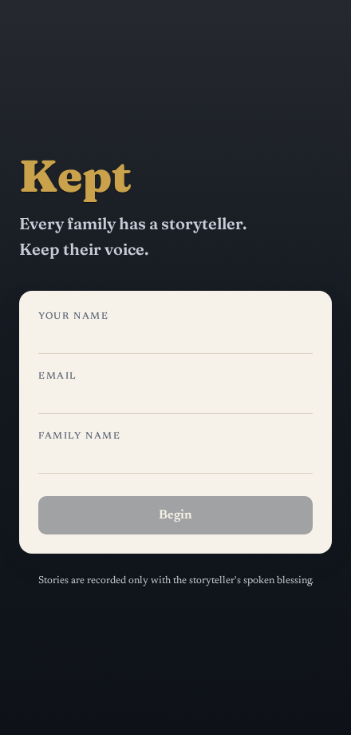
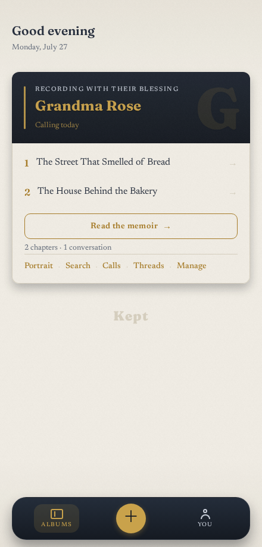
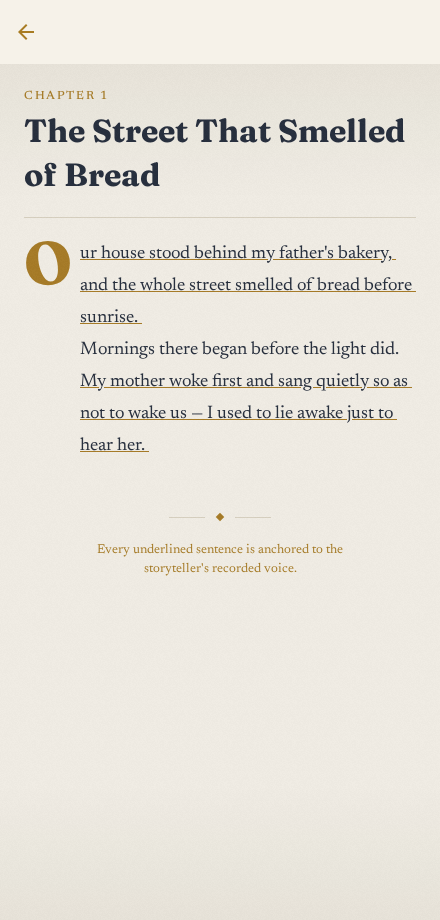

</div>

---

## Why

Our grandparents carry a lifetime of stories — the street that smelled of bread, the song a mother
sang before sunrise — and almost none of it is ever written down. When they're gone, the details go
with them.

Writing a memoir is hard work an 80-year-old won't do. But *talking* is easy. **Kept** turns a
gentle weekly phone call into a book: it calls, it listens like a favorite grandchild who finally
has time, and after every call it writes the next chapter — with every factual sentence anchored to
the words they actually spoke, so nothing is invented.

It is **universal by design**: any family, any language, any storyteller. (Indic languages are only
a go-to-market wedge, isolated to provider config — never the product's identity.)

---

## What it does

- **Calls the storyteller** on the phone, in their language, on a cadence the family sets. A warm
  interviewer opens with a greeting ritual, asks for consent before anything is recorded, follows
  *one* thread at a time, and slows down for grief instead of interrogating it.
- **Remembers everything.** Each call becomes a transcript → structured facts → a running *Life
  Brief*, so the next call references what was said last time, like family would.
- **Writes a chapter after every call.** A biographer model drafts the chapter; a **fidelity
  verifier** promotes it from *draft* to *verified* only when every factual sentence is supported by
  the transcript segments it's anchored to. Sentences carrying real recorded audio wear a fine gold
  thread — *fidelity, made visible.*
- **Draws a living portrait.** From the life graph the pipeline builds — the people, places, and
  things a life keeps returning to — Kept assembles a **Portrait** that carries the words the
  storyteller actually spoke about each one, set in the italic reserved for their exact voice.
  Nothing is invented; every line traces to something they said.
- **Reads as one book, and finds anything in it.** The family can read the whole **memoir** end to
  end in one continuous, letterpress-styled sitting, and **search** across both the written book and
  the storyteller's own recorded words to find a person, a place, or a moment.
- **Gives the family a keepsake app** — a warm, letterpress-styled reader where they read the memoir
  and (with the storyteller's blessing) hear it in the real voice. The family owns it and can erase
  any album, entirely, at any time.

---

## The screens

<div align="center">

| The album | A chapter | The conversation |
|:---:|:---:|:---:|
|  |  | 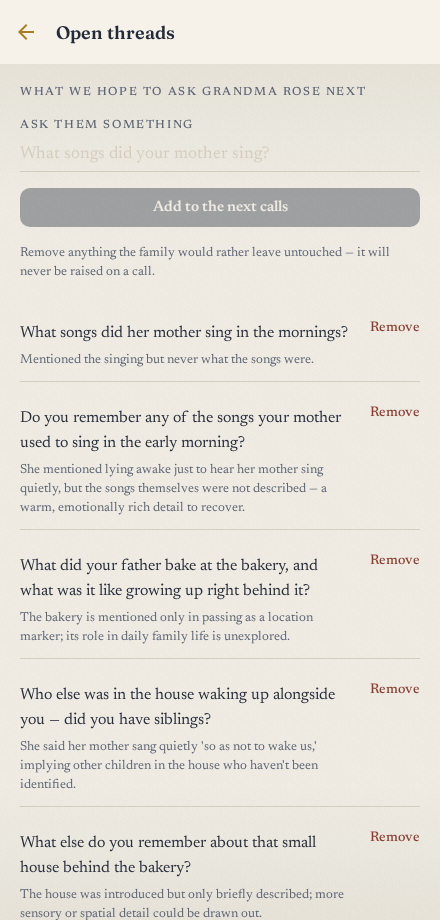 |
| Each storyteller is a monogrammed album; the greeting is the masthead; a glass bottom-nav ties it together. | A drop-cap opens the chapter; gold-underlined sentences carry the real recorded voice. | "Ask them something" — the family plants questions that flow into the next real call. |

| Calls | Manage | Add a storyteller |
|:---:|:---:|:---:|
|  | 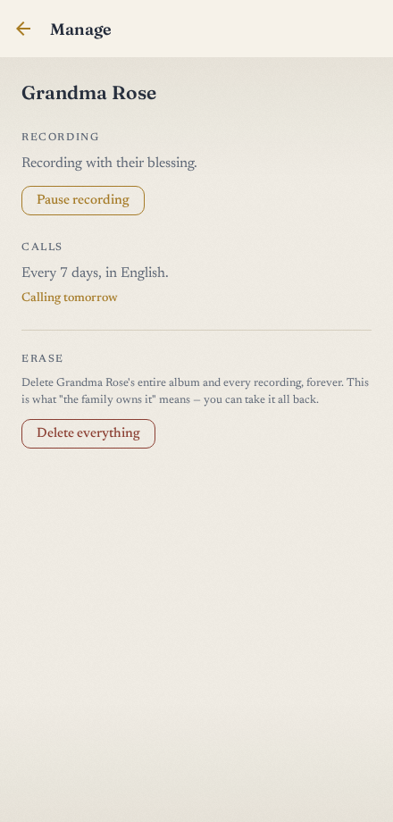 | 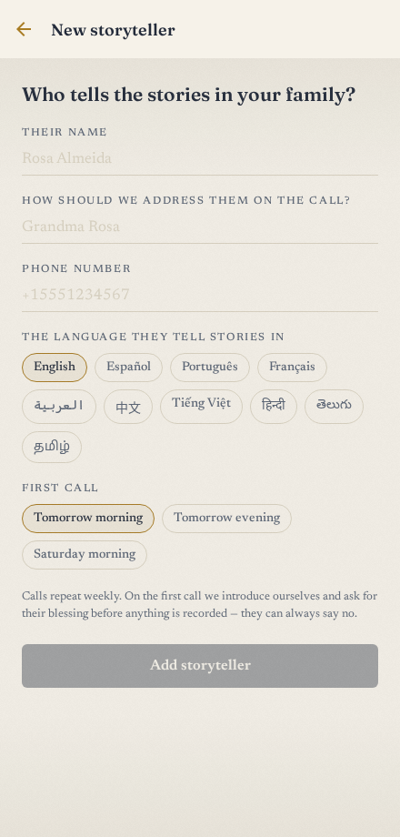 |
| A timeline of every conversation, with honest states. | Consent, cadence, and a one-tap "erase everything." | Universal — any name, any language, any voice. |

| Portrait | You | Arrival |
|:---:|:---:|:---:|
| 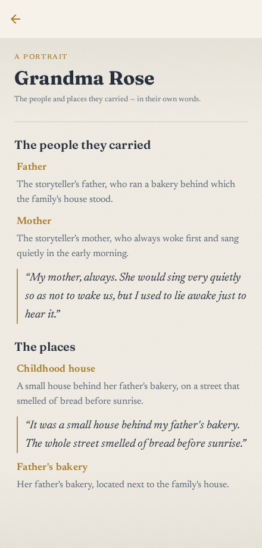 | 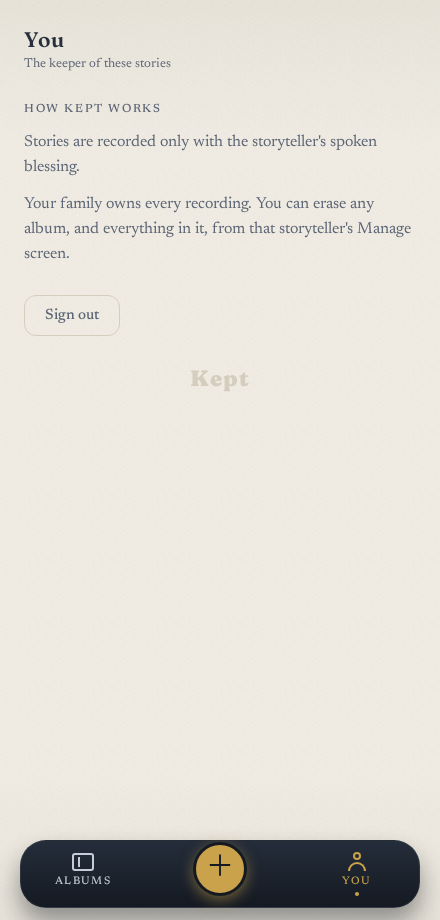 |  |
| Who they are — the people and places of a life, each carrying the words they actually spoke. | The keeper's account, kept simple. | Opening the album, in lamplight. |

| The whole memoir | Search |
|:---:|:---:|
| 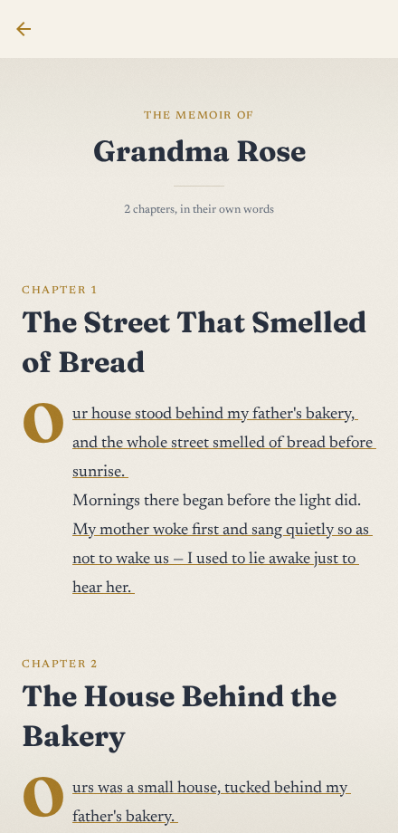 | 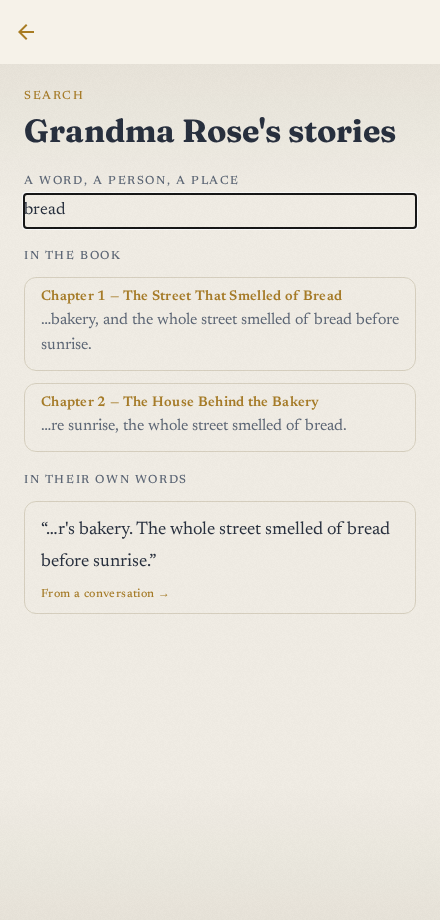 |
| The book read end to end — each chapter opens with a drop cap; the recorded sentences keep their gold thread. | Find a story or a moment across the written book and the storyteller's own recorded words. |

</div>

---

## How it works

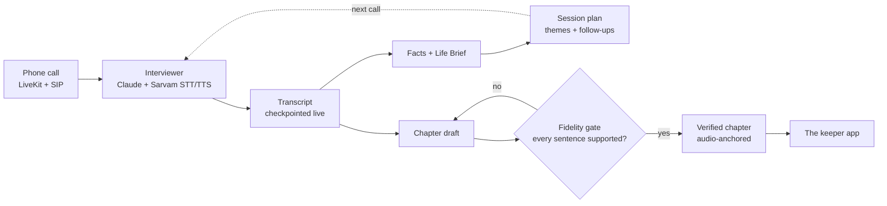

**Provenance-first is the whole point.** A chapter never ships a sentence the storyteller didn't
support. The verifier judges each anchored sentence against its transcript segments (with a verbatim
fast-path and parallel judging); anything unsupported keeps the chapter in *draft* and out of the
family's hands.

---

## Architecture

A [uv](https://docs.astral.sh/uv/) workspace monorepo (Python) plus an Expo app (TypeScript).

```
kept/
├── packages/core        # shared: models, DB, config, the LLM backend seam
├── apps/server          # FastAPI + async SQLAlchemy + Alembic — the API & pipeline
│   └── pipeline/        #   extraction · life-brief · planner · chapters + fidelity
├── apps/voice           # LiveKit Agents worker — the live interviewer (Sarvam STT/TTS)
├── evals                # synthetic elders interviewed by the real interviewer, judged on craft
├── apps/mobile          # Expo / React Native 0.86 — the keeper app + "Heirloom" design system
└── scripts              # talk.py (free browser voice demo), setup-sip.sh, demos
```

**The LLM backend is a seam.** `LLM_BACKEND` selects `api` (the Anthropic SDK — streaming, prompt
caching; required for a natural live call) or `claude-cli` (headless Claude Code on a subscription —
free, slower; powers the offline pipeline, the evals, and a $0 voice demo).

**Stack:** Python 3.12 · FastAPI · async SQLAlchemy · SQLite (dev) / Postgres (prod) · Alembic ·
LiveKit Agents + SIP · Sarvam (Indic STT/TTS) · Anthropic Claude · Expo · React Native · TypeScript.

**Design system** (`apps/mobile/src/design/`): a two-scene system — warm letter *paper* and
lamplit *cover* — set in **Fraunces** (display), **Newsreader** (prose; italic for the storyteller's
exact words), and **Space Mono** (the tape counter), with real paper grain, a foil monogram per
album, and a signature gold voice-thread.

---

## Run it locally

Prerequisites: [`uv`](https://docs.astral.sh/uv/), Node + [`pnpm`](https://pnpm.io/). Sarvam and
LiveKit keys are only needed for live voice.

```bash
# 1. backend API  (http://localhost:8000)
uv run --package katha-server uvicorn katha_server.main:app --reload

# 2. the keeper app  (http://localhost:8081 — press w for web)
cd apps/mobile && pnpm install && pnpm exec expo start --web

# 3. hear the interviewer for free — a scripted conversation on the CLI brain
uv run --package katha-voice python scripts/demo_interviewer.py

# 4. talk to it live in your browser (needs LiveKit + Sarvam keys; no phone)
uv run --package katha-voice python scripts/talk.py
```

Copy `.env.example` → `.env` and fill what you need. `LLM_BACKEND=claude-cli` runs the whole
pipeline for free on a Claude subscription.

---

## Status

**Working locally, end-to-end:**
- The full memory pipeline — call transcript → facts → Life Brief → planned themes → a
  fidelity-verified, audio-anchored chapter.
- The live voice interviewer over WebRTC (Sarvam STT → Claude → Sarvam TTS), verified in the
  browser; a $0 path via the `claude-cli` brain.
- The complete keeper app: onboarding, the album, the reader, the whole-memoir view, search, the
  living portrait, calls, transcripts, follow-ups, consent + erasure — browser-verified, responsive.
- An eval harness: synthetic elders interviewed by the *real* interviewer, scored by a judge on six
  craft dimensions.

**Gated on external accounts (bring your own):**
- Real **phone** calls — a SIP trunk (`SIP_TRUNK_ID`, e.g. Twilio). `scripts/setup-sip.sh` wires it.
- Cloud **audio archive** — object storage (Cloudflare R2) for recording playback.

---

<div align="center">

Built by **Yashwanth Kamireddi**.

*A grandchild who finally has time to ask about everything.*

</div>
